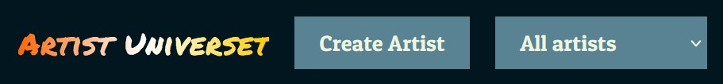

<div align="center">
     
</div>

# Node.js og Express.js

I dette projekt har jeg lavet en frontend hjemmeside Artist Universet hvor en bruger kan tilgå forskellige artister.
Det er her mening at brugeren kan tilføje flere artister til siden, ved at udfylde en create form, hvor information omkring artisten skal indsættes.
Det er derudover også muligt for brugeren updatere en artist, hvis nu der skulle være en ændring.
Det er også muligt at helt fjerne en artist hvis, brugeren ikke længere følger at de ønsker at have dem mere.
Brugeren kan også gøre artisten til en favorit, hvilket gør at de nu vil fremgå inde på favorit siden.

Favorit siden og den generelle side, er to forskellige lister, så hvis man sletter en artist på den ene side, så vil de stadig fremgår på den anden.

## Installation

For at clone projektet så du selv kan arbejde med det, så er det vigtig at du har [git](https://git-scm.com/downloads), inden du starter. Når du har det kan du følge guiden nedenfor:

1. Åben din terminal

2. Naviger til den mappe, hvor du gerne vil gemme projektet ved hjælp af `cd`-kommandoen. For eksempel:

```bash
cd din/målmappe
```

3. Når du er i mappen du gerne vil være i skal du bruge følgende kommmando til at clone projektet fra GitHub:

```bash
git clone https://github.com/MarkusIngerslev/node-js-og-express.git
```

4. Du har nu clonet projektet. Hvis du ønsker at køre det clonet program kan du gøre følgende

```bash
cd /node-js-og-express
```

-   når du så er inde i projektet kan du skrive `code .` i terminalen for at åbne projektet i din tekst editor.

## Brug af hjemmeside

Når du nu har downloaded projektet og gerne vil prøve at bruge projektet, så er der lige nogle ting du først skal gøre. Først er det vigtig at du starter databasen, **da det er en lokal database stopper den med at være aktiv, sammen med at du lukker programmet**.

#### Opstart af database

For at starte databasen skal du gøre følgende:

1. Åben en terminal og naviger således at du står i projket mappen.

```bash
cd C:\Users\UserName\Projects\node-js-og-express
```

2. naviger så vider ind til backend mappen

```bash
cd backend/
```

3. Når du er i backend mappen kan vi starte databasen, der er to måder hvorpå dette kan gøres:

```bash
node --watch app.js
```

```bash
npm start
```

4. Nu burde du gerne i din terminal få en besked om at din server køre på en `ip`.

    Grunden til at det er muligt at starte serveren med `npm start`, er fordi der er lavet et script i package.js der køre den samme funktion som først vist.

#### Opstart af hjemmeside

Efter at du nu har fået databasen til at køre kan du starte hjemmesiden op. Dette bliver gjort gennem brugen af extensionen [liveServer](https://marketplace.visualstudio.com/items?itemName=ritwickdey.LiveServer).

1. For at åbne hjemmesiden gennem live server skal du højre klikke på html filen, inde i frontend mappen. Hvorefter du så skal klikke på start liveserver.

    Et nyt browser vindu skulle gerne åbne op, med hjemmesiden for projektet.

2. Du er nu fuldt klar til at bruge hjemmesiden, og se hvad du kan gøre!
